# 寻码网文章资讯管理系统

 
---
### 👉作者QQ ：1556708905 微信：zheng0123Long (支持定制修改、部署调试、定制毕设)

### 👉接网站建设、小程序、H5、APP、各种系统等

---

#### 介绍
本系统是基于JavaWeb实现的寻码网文章资讯管理系统，前端：html + ajax；后端：SpringBoot+Mybatis-plus；系统环境：jdk1.8 | mysql | redis。满足基本的个人博客的搭建

#### 软件架构
后端：SpringBoot+Mybatis-plus  
前端：html + ajax    
系统环境：JDK1.8 | Mysql | Maven | Redis  

#### 功能介绍
##### 【代码结构与数据库截图】
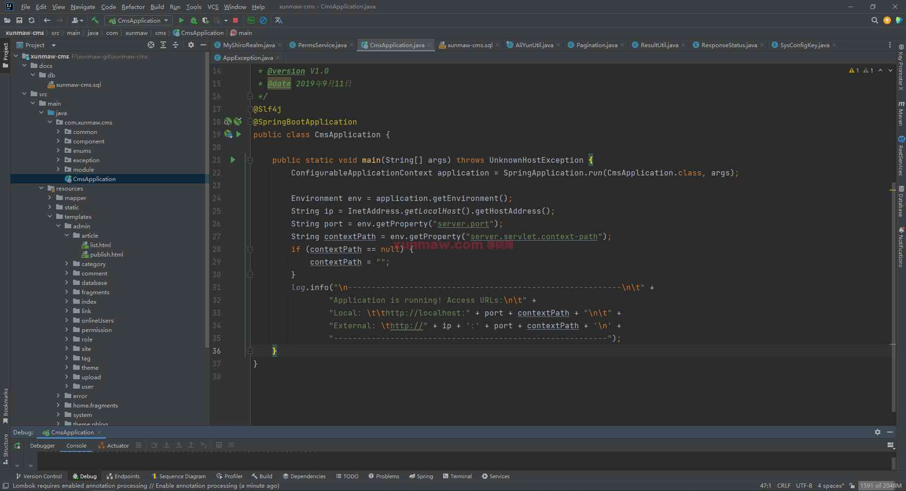
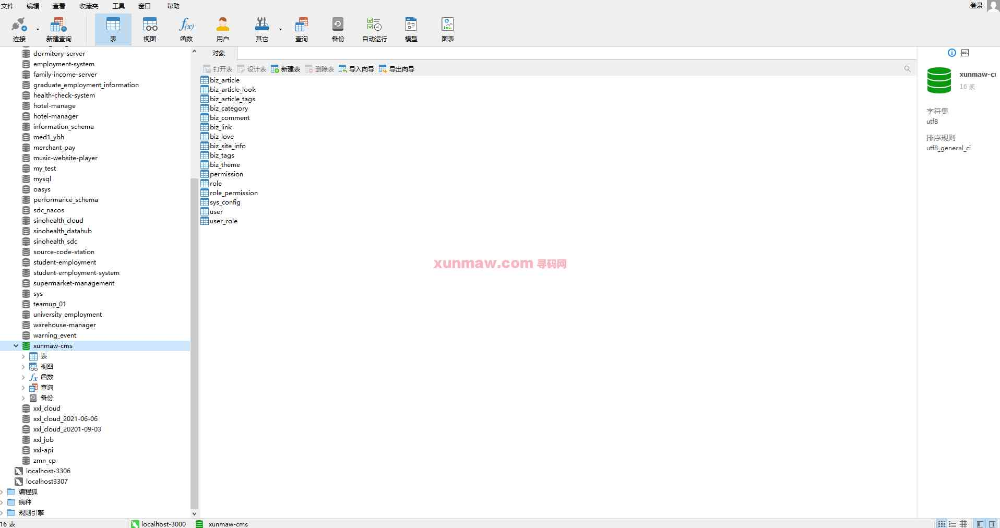

##### 【功能详述】 
后端管理-登录页  
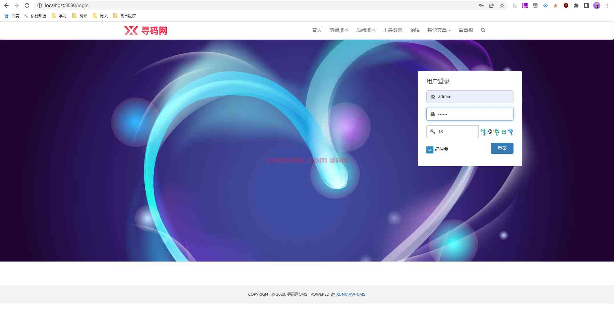

后端管理-首页  
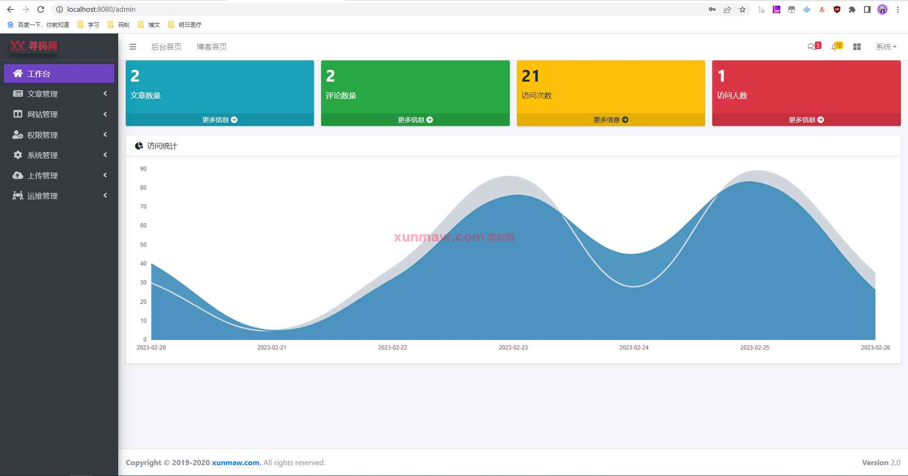

后端管理-文章管理-发布文章  
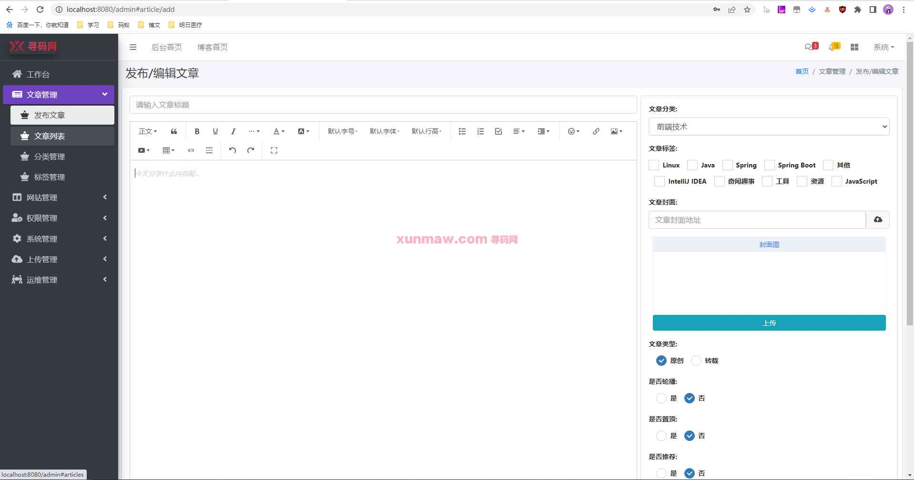

后端管理-文章管理-文章列表  
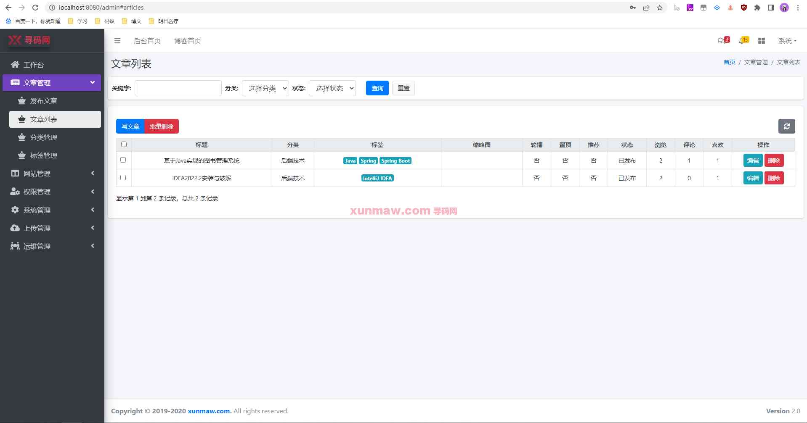

后端管理-文章管理-分类管理  
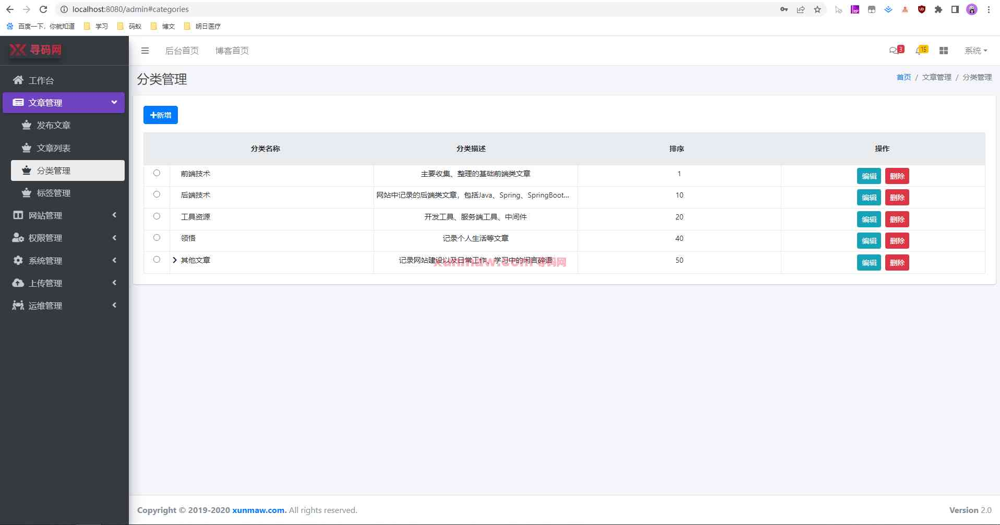

后端管理-文章管理-标签管理  
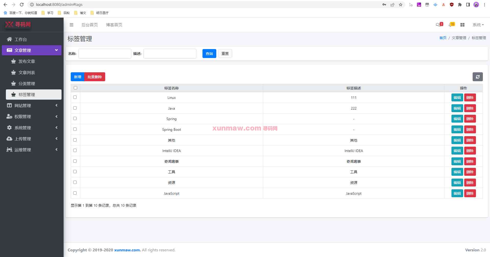

后端管理-网站管理-基础信息  
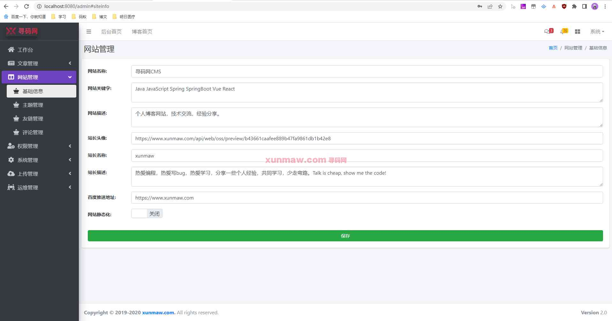

后端管理-网站管理-主题管理  
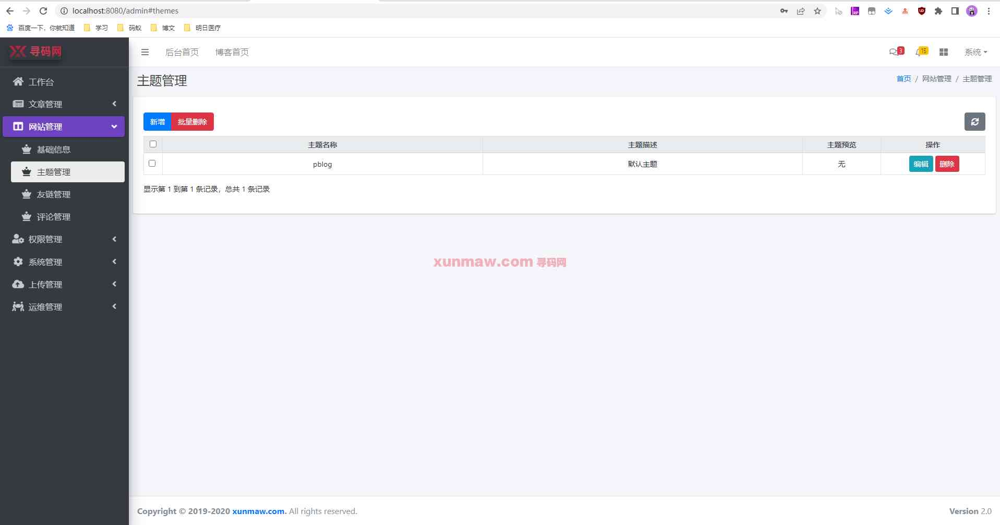

后端管理-网站管理-友情连接  
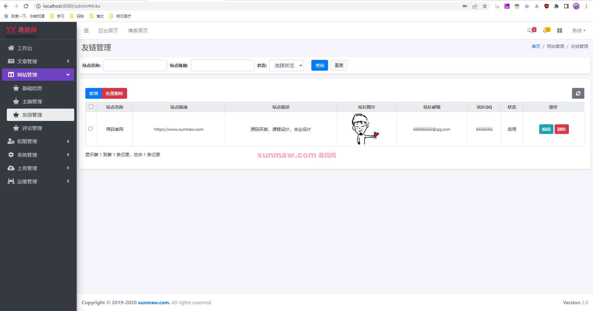

后端管理-网站管理-评论管理  
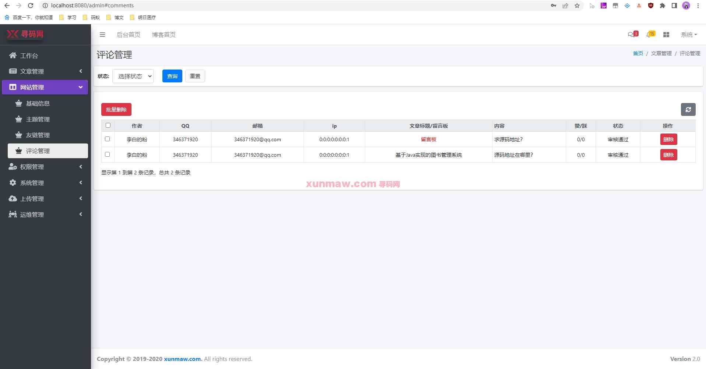

后端管理-权限管理-用户管理  
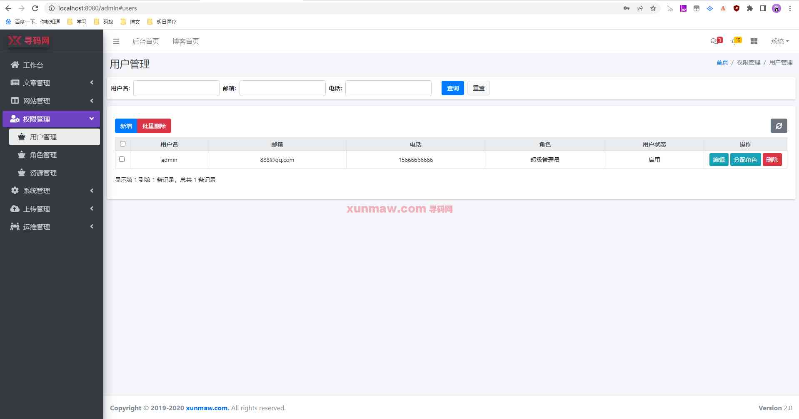

后端管理-权限管理-角色管理  

后端管理-权限管理-资源管理  
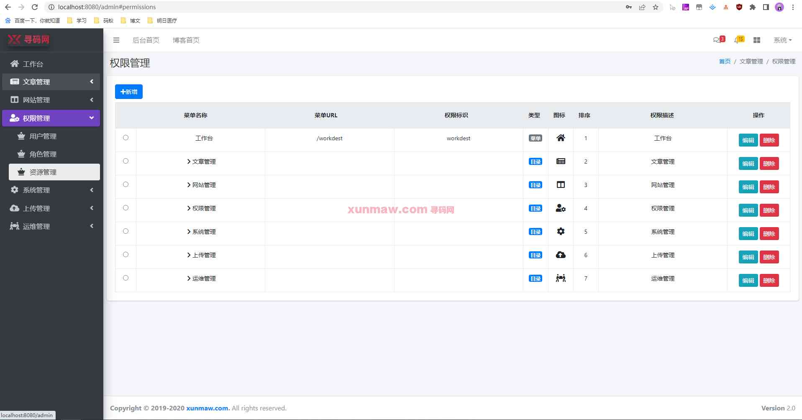

后端管理-系统管理-在线用户  
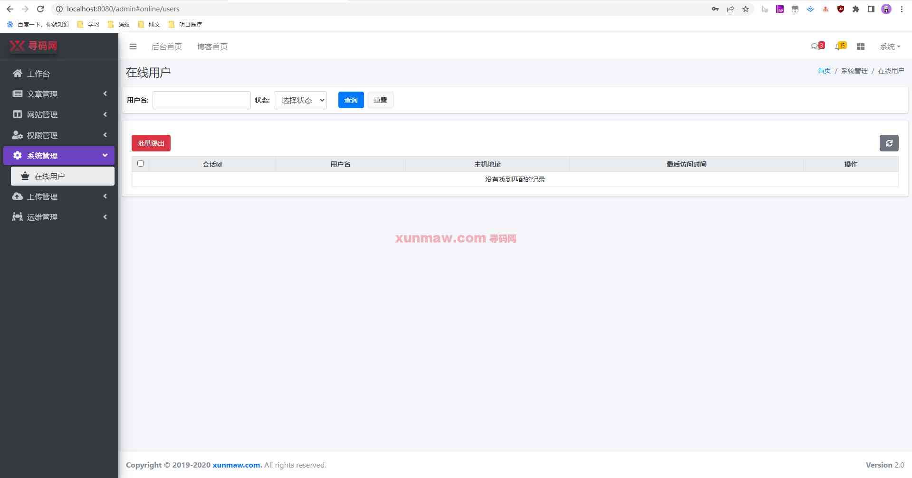

后端管理-上传管理-文件上传设置  
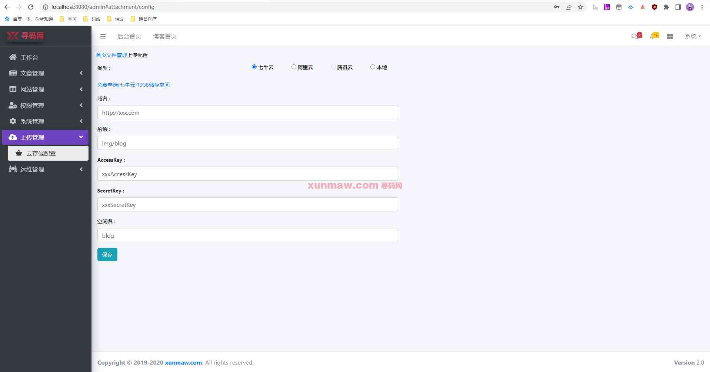

后端管理-运维管理-数据监控  
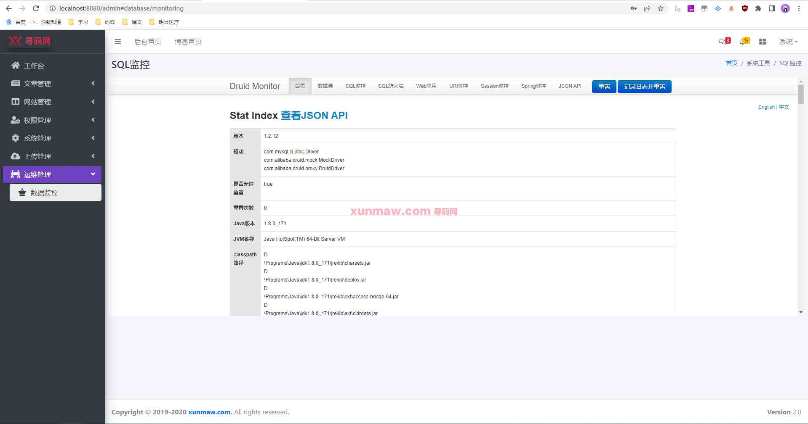

应用端-首页  
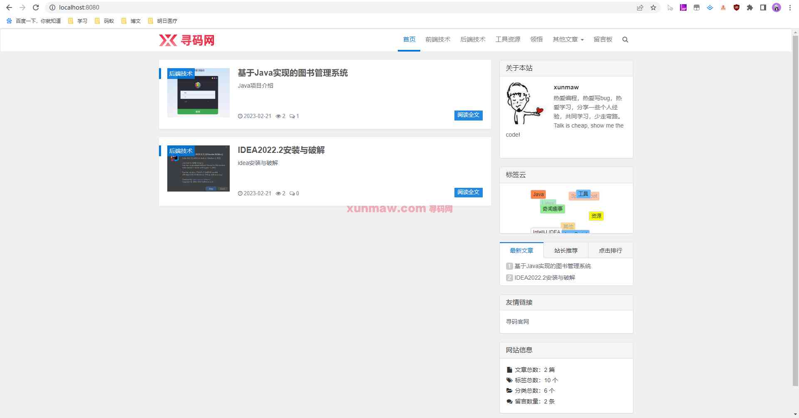

应用端-文章资讯明细  
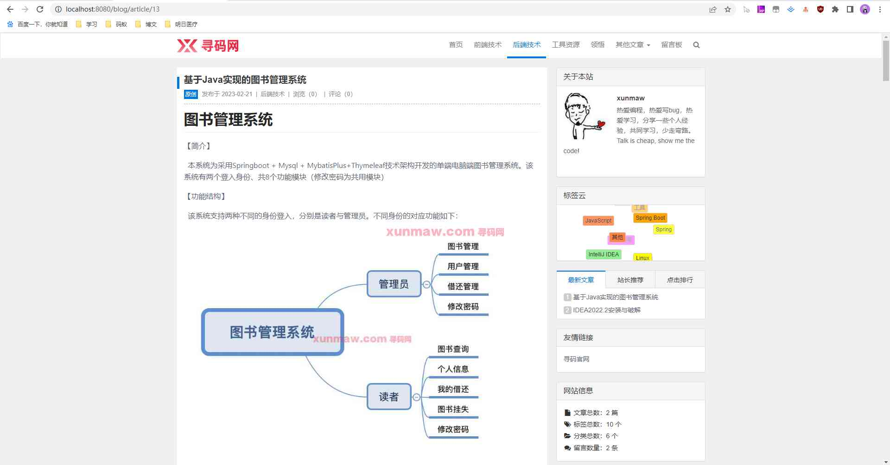

应用端-留言板  
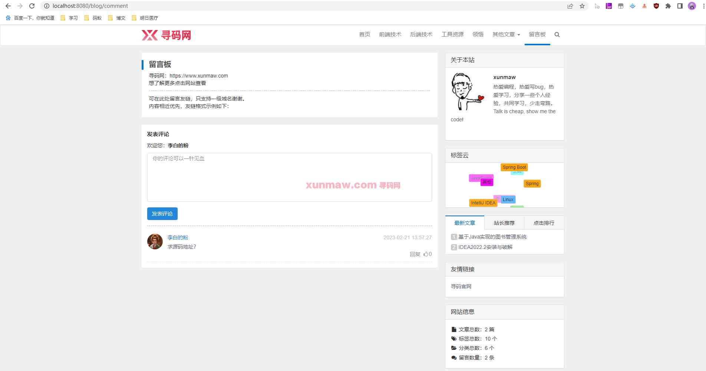

#### 项目预览
地址：[商品详情 ](https://www.xunmaw.com/shop/detail/1631121495653433345)   
点击商品详情中的演示地址，看查看系统录制的视频    

#### 使用说明
1. 创建数据库，执行数据库脚本
2. 修改jdbc数据库连接参数
3. 下载安装maven依赖jar
4. 在tomcat服务器部署项目
    管理后台：    
    请求地址： http://localhost:8080/admin    
    用户名：admin  
    密码：123456  
    WEB端：      
    请求地址： http://localhost:8080
    用户名：user  
    密码：123456

